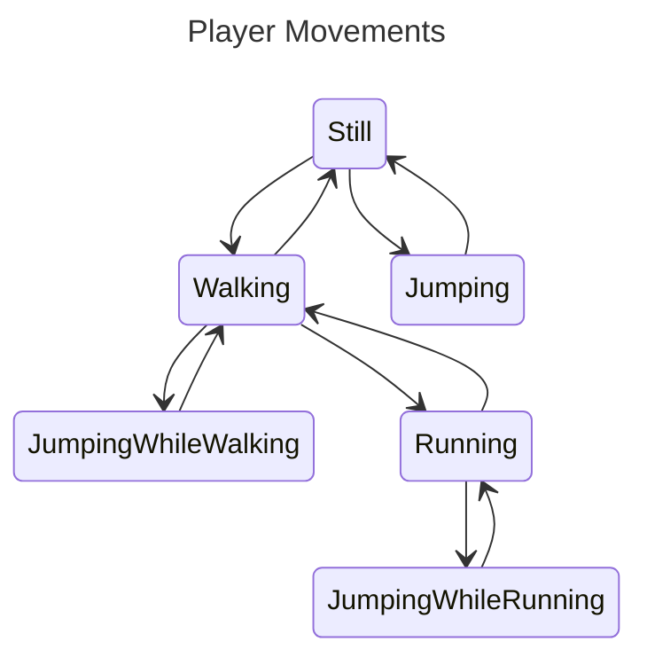

# Player Scenario

The state pattern could be used to model a Player in the context of a game.

## State Diagram

## Movement Rules

1. A player can perform the following movements:
    * Walk
    * Run
    * Jump
    * Stop
2. The jump lasts `2` loops when still, `3` when walking, and `5` when running.

## Weapon Rules

1. Aiming is possible only when `Still` or `Walking`.
2. Full shooting accuracy `100%` is achieved only when `aiming` while `Still`.
3. Shooting `without aiming` reduces the accuracy by `20%`
4. `Walking` reduces the aiming accuracy by `10%`.
5. `Running` reduces the aiming accuracy by `25%`.
6. `Jumping` reduces the aiming accuracy by `30%`.

